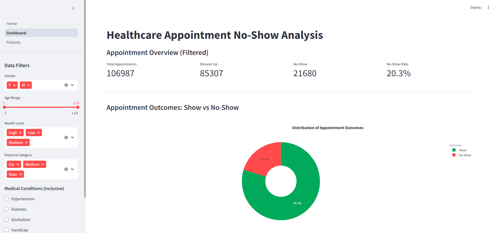
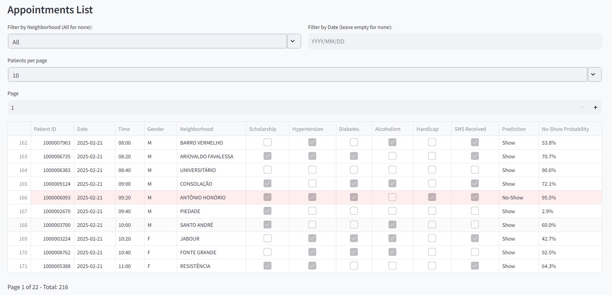
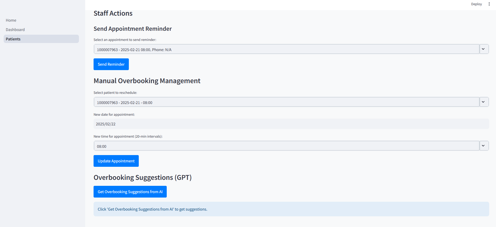

# 🏥 Healthcare No-Show Management System  

**AI-powered platform to predict patient no-shows and optimize scheduling in healthcare**  

---

## 📅 Developed by: Giuseppe Nicolò  
📄 **Dataset Used:** Medical Appointment No Shows - Kaggle  

## 🚀 Project Overview  
This project is an **AI-driven web application** that predicts the probability of patient no-shows and provides **actionable recommendations** for scheduling efficiency in healthcare centers, hospitals, and clinics.

### **🔹 Key Features**  
✅ **Predictive Model (XGBoost)** – Forecasts no-show probability for each appointment  
✅ **Interactive Dashboard** – Visualizes patient trends and no-show analytics  
✅ **AI Recommendations (GPT-4o Mini)** – Suggests overbooking slots and reminder notifications  
✅ **Manual Staff Control** – Allows healthcare staff to adjust schedules and send reminders  

---

## 🎯 How It Works  

### 1️⃣ Data Collection  
- The system analyzes **historical patient appointment data** from Vitoria, Brazil (2016).  
- Uses patient **demographics, medical history, and past attendance behavior** to identify patterns.  

### 2️⃣ Machine Learning Predictions  
- **XGBoost model** predicts the likelihood of a patient missing their appointment.  
- Results are displayed with a **real-time probability score** for each upcoming appointment.  

### 3️⃣ AI Recommendations  
- **Overbooking Suggestions** – Identifies time slots where an **extra patient** can be scheduled.  
- **Reminder Notifications** – Recommends sending **SMS reminders** to high-risk patients.  

---

## 📊 Dashboard Overview  

👀 The web application provides an **interactive dashboard** where healthcare providers can analyze trends and make **data-driven decisions**.  

  

👨‍⚕️ **Healthcare staff** can also view **upcoming appointments** and take action based on AI insights.  

  
  

---

## 🖥 Installation & Setup  
### **🔹 Clone this repository and install dependencies**  
```
git clone https://github.com/yourusername/healthcare-no-show.git
cd healthcare-no-show
pip install -r requirements.txt
```

```
python -m uvicorn app.api:app --host 0.0.0.0 --port 8000 --workers 8  
```
```
streamlit run Home.py    
```

## 📩 Contact & Support  

💼 **Giuseppe Nicolò**  
📧 **nicologiuse2003@outlook.it**  
